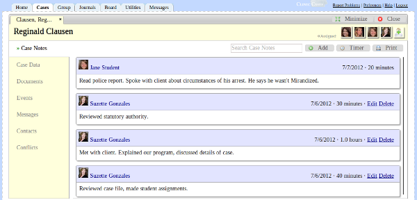
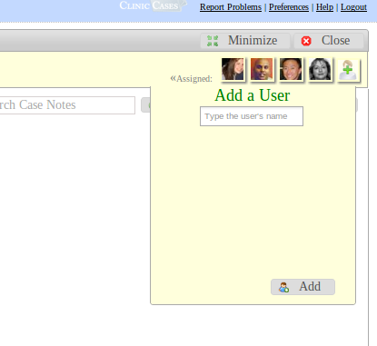
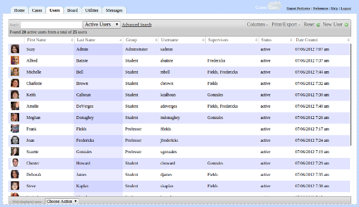
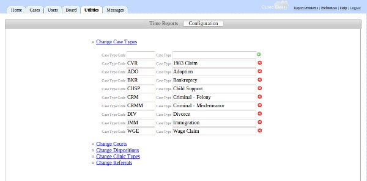
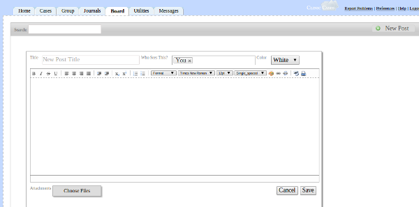
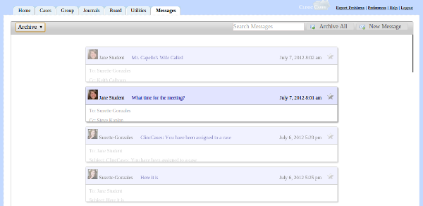
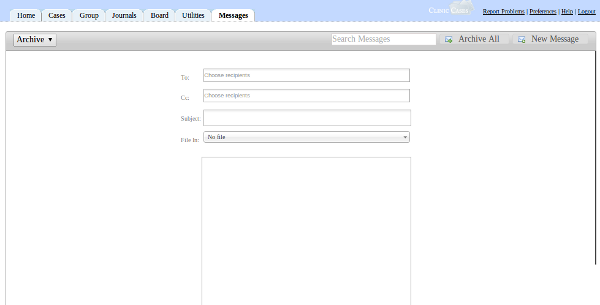
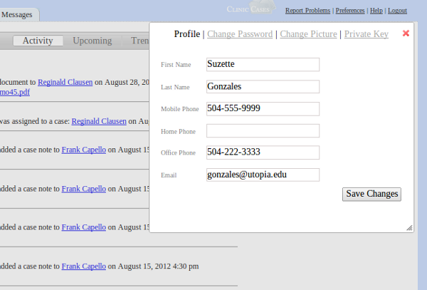

#ClinicCases 7 Documentation

## [Table of Contents](#contents)
* [Getting Started](#getting_started)
* [Home Tab](#home_tab)
* [Cases Tab](#cases_tab)
* [Group Tab](#group_tab)
* [Journals Tab](#journals_tab)
* [Users Tab](#users_tab)
* [Utilities Tab](#utilities_tab)
* [Board Tab](#board_tab)
* [Messages Tab](#messages_tab)
* [Preferences](#preferences)
* [Mobile](#mobile)
* [Installation](#install)
* [Customization](#customization)
* [Source Code](#source)
* [More Information](#more_information)
* [MIT License](#license)
* [About ClinicCases](#about)

##Getting Started

Once your ClinicCases is installed on your server (see [Installation](#install)), here's how to get started. ClinicCases ships with three pre-defined user groups: Administrators, Professors, and Students.  These groups can be [customized](#customization).  You should log in using the default administrator account:

* Username: admin
* Password: admin

You will then be prompted to change your password.  Once that is done, click on the Users tab.  You should see that there is only one active user, Temp Admin.  You should add at least one new administrative user by clicking on New User in the upper-right hand corner.

Be sure to include your email address in the new user information.  Check to see if your mail server is working and then check your email for an email with a temporary password to the new account.  Log on to ClinicCases with these credentials and then [change your password](#preferences).  You can now delete the Temp Admin account by going to Users, opening Temp Admin and pressing delete.

Other users can get accounts in one of two ways: 1) You can add them by clicking on "New User" and inputting the appropriate information for each user or 2) new users can sign themselves up. To do the latter, users should click on "Need an Account?" on the login page.  They will be prompted for the information.  You should then receive an email from ClinicCases notifying you that a new user has signed up.  You (or anyone with an administrative account) must approve the application before that user has access.  To do this, go to the Users tab.  You should see a dialog prompting you to approve the application like this:

If you click yes, you will be brought to a list of new users to be activated.  You can either 1). click on each individual user, review the information, and then set his/her status to active or 2) using the menu at the bottom of the screen (where it says "With Displayed Users"), select "Make Active."  It is important that an administrator review each new user application to ensure that it is a legitimate application and not spam.

Once you have activated the new user, he or she will receive an email confirming that the account is now activated.  The user can log in with the username provided in the email and the password that he or she provided when submitting the application.

If the user application is invalid (a spam sign-up or a duplicate account, for example), you can delete the account by pressing "Delete."

Once you have your users set up, you will want to enter some [cases](#cases_tab_new_case).

[Go to Top](#contents)

##Home Tab

The Home tab is designed to give you a quick look at what's going on.  It's broken up into three sections, Activity, Upcoming, and Trends.

* __[Activity](#home_tab_activity)__ - Shows you the latest actions taken on ClinicCases which are relevant to you.

    

	Assuming the default [groups](#customization_groups) are set, professors see every action on a case to which they are assigned and every action taken by users who they supervise.  Students see only every action taken on any case to which they are assigned.  Administrators see information about the opening and closing of cases and about new account requests.  All users see information about [board posts](#board_tab).

	An RSS feed of this activity is available.  Click the RSS icon next to the activity stream and you will be directed to your rss feed.  Add the URL of the feed to your favorite feed reader.  The feed is secured using a private key which is known only to you.  If you suspect that your feed may have been compromised, you can reset the key by going to [Preferences](#preferences) and clicking on Private Key.

* __[Upcoming](#home_tab_upcoming)__ - Shows upcoming events which are relevant to you.

	

	This is a calendar which shows all events to which you have been assigned.  Events can be added in two ways 1) From inside a case, by clicking Events and then "New Event" or 2) using the [Quick Add](#home_tab_quick_add) button on the Home page.  You can switch between Month, Week, and Day views.  Clicking on an event will bring up a details dialog which will show who is assigned to the event and other relevant information.

	An Ical feed of your events is available by clicking on the Ical icon at the top of the calendar.  Add the URL of the feed to your calendaring program (e.g, Google Calendar).  Instructions on how to do this for your specific calendaring program are probably available by Googling "how to add Ical feed to [insert name of your calendaring program]."

* __[Trends](#home_tab_trends)__ - Shows graphical data about user and case activity.

	Depending on your group, Trends shows you graphical information about activity on ClinicCases.  Professors will see which students are the most active over time and which cases have the most activity.  Students will see information about their activity and the activity of others in their group.  Administrators will see clinic-wide information about case and user activity.

	As of Beta 4.2, Trends is not yet implemented.  Further documentation will be added once the feature is complete.

* __[Quick Add](#home_tab_quick_add)__  - Quickly add data to ClinicCases

	

	The Quick Add button is designed for you to quickly enter case notes and events without having to take the extra steps of navigating into a case.  Clicking on the button will bring up a dialog with a choice to add a case note or an event.

	With a case note, you select the appropriate case from the list of case to which you are assigned, add a time value, and then add a note.  After you click "Add", the case note will be automatically filed in the case.  Note that the default choice in the case list is "Non-Case Time."  This is the only place in ClinicCases to record activity not associated with a case.  Activity filed here can include things such as class time, attending orientation, etc.  As of Beta 4.2, there is no way to delete or edit non-case time.

	With an event, you enter the title of the event, where it is taking place, and the start and end times.  You can then associate the event with a case by selecting from the drop-down list.  In the field labeled "Who?", you type in the names of everyone who is responsible for this event.  If you choose a group, everyone in that group will be responsible and will see the event in their calendar feeds. Please note that if you do not add yourself to the event or you are not in one of the assigned groups, you will not see the event in your calendar.

	[Go to Top](#contents)

##Cases Tab

###Cases Table

The cases table shows you a list of all cases you are allowed to view.  If you have administrative privileges (i.e.,"view_all_cases" is set to "1" for your group in the cm_groups table - _see [customizing groups](#customization_groups)_), you will see all cases on the system.  All other groups only see cases to which they have been assigned.

* __[Open/Close Filter](#cases_tab_filter)__   The default filter is set to display only cases that are open.  An open case is defined simply as any case which has no date closed.  You can switch the filter to show only closed cases or all cases.
* __[Search](#cases_tab_search)__    The search box searches through all rows and columns (including those that are not displayed) for the search text you input.
* __[Advanced Search](#cases_tab_advanced_search)__   Do fine-grained searches:
	

	Clicking on advanced search will bring up a sub-header which allows you to search a specific column or combination of columns.  You can, for example, search for all cases opened between two dates, search for all cases with a specific disposition, etc.  When you are finished with your advanced search, click Reset and the table will be returned to its original state.

* __[Sort](#cases_tab_sort)__   You can sort each column row by clicking on table header for that row (e.g, "Last Name").  Clicking the header again will toggle between an ascending and descending sort.

* __[Columns](#cases_tab_columns)__   ClinicCases allows each user to determine which columns are displayed in his or her table.

	

	Different users need different information from the cases table.  An administrator might be interested in who opened a case and the case number, but a professor might be more interested in who is assigned to the case and what court is in.  Because of this,  ClinicCases allows you to choose which columns are displayed in your table.  Just click on the Columns button and add a check by those columns which you wish to see.  ClinicCases will remember your chosen columns and display them every time you return to the Cases tab.  If you ever decide to go back to the default, just click "Restore Original" at the bottom of the columns list.

* __[Print/Export](#cases_tab_print_export)__   There are a number of options for getting your data out of ClinicCases. When you click on the "Print/Export" button you will see choices to Copy to Clipboard, Export to CSV, Export to Excel, Export to PDF, or Print.  These actions will export the currently filtered data to the chosen format.  Print/Export is useful for generating reports and for exporting your data to a spreadsheet program for further analysis.

* __[Reset](#cases_tab_reset)__   Clicking the Reset button resets all filters on the table to the default (i.e, open cases).  Note that ClinicCases remembers the state of your filter.  So, if you were to search for all clients named "Smith" and then log off, when you return to the cases table later it will still display all clients named "Smith."  You must press reset to clear that filter.

* __[New Case](#cases_tab_new_case)__   Administrative users (i.e, those with "add_cases" set to "1" for their group in the cm_groups table - _see [customizing groups](#customization_groups)_) will see a "New Case" button after the Reset button.  Clicking on this will open a new case and prompt you to input the intake information for the new case.  Once you have entered in the intake information, be sure to click "Submit".  The new case will now be opened.  You should next [assign users](#assign_users) to the case.

###Case Detail

When you click on a table row in the cases table, the case detail will be opened.

Think of this as opening the manila folder your physical files are kept in and seeing everything divided into neat tabbed sections.  There are seven sections for each ClinicCases file.

* __[Case Notes](#cases_tab_casenotes)__ 
 Case Notes are the primary means of recording information about case activity.  They are the replacement for the "Timesheets" or "Memos to File" you may have in your paper files.  Each case note records the date on which the activity took place, the amount of time in took, and a description of the activity.  Note that in ClinicCases time is measured in 5 minute intervals by default.  You can change this to 6 minute intervals by editing the configuration file (_see [configuration](#customization_case_numbers)_).

	There are three buttons above the case note list: 1) Add 2) Timer and 3) Print.  The first and third are self-explanatory.  The timer button will launch a timer that records your activity on the case.  This is useful for situations when you are working on a case in front of your computer (e.g, doing legal research).

	

	Once you have clicked "Timer", it will continue to run until you turn it off.  This means that, even if you close your browser, when you return to ClinicCases, the timer will still be running. It is therefore important to remember to click "Stop" to turn it off.  When you do this, a dialog will ask you for a description of what you did.  Once you  provide that and click "Add", the case note will be filed away in the case with the correct time and information.

* __[Case Data](#cases_tab_case_data)__ 
 Case Data is where intake information about the client (Address, date of birth, SSN, case type, etc.) is kept.  Users who are authorized can click "Edit" and change the intake information.  Any user who is in a group with "edit_cases" set to "1" in the cm_groups table (_see [configuration](#customization_groups)_) can do this.  By default, all users have this permission.

* __[Documents](#cases_tab_documents)__ 
 ClinicCases has a fully-featured file manager.

	

	* New Document - Clicking this will open ClinicCases' rich-text editor and create a new ClinicCases document.  This is an alternative to creating a document on your desktop computer and is useful and time-saving for creating casual documents, such as digests of legal research, to-do lists, notes on interviews, etc.

	* New Folder - Clicking on this button creates a new folder. You name the folder by clicking under the folder ("New Folder"), typing in the desired name, and then pressing enter. Subfolders can be created by clicking into the folder and then repeating this process.

	* Upload - Clicking upload will prompt you to either upload files from your computer or to save a URL.  Multiple files can be uploaded at the same time (in Chrome, Firefox, and Safari, not Internet Explorer) by holding down the control key as you select files.  The types of files which can be uploaded are controlled by your configuration.  By default, the following extensions are allowed: 'doc','docx','odt','rtf','txt','wpd','xls','ods','csv','mp3','wav','ogg','aif','aiff','mpeg','avi','mp4','mpg','mov','qt','ovg','webm',
	'ogv','flv','bmp','jpg','jpeg','gif','png','svg','tif','tiff','zip','tar','gz','bz',and 'pdf'.

	* Renaming, Deleting, and Moving Files and Folders - Right-clicking on a file or folder will bring up a dialog which allows you to cut/copy/rename/or delete that item.  You can also move items by dragging them to the desired folder.  You can see meta-information about a file (who uploaded it, time of upload, etc) by selecting "Properties" from the right-click menu.

* __[Events](#cases_tab_events)__ - All case-related events are saved here.  These events will show up on the Home page calendar and Ical feeds of everybody who is assigned to the case.

* __[Messages](#cases_tab_messages)__ 
 This shows all messages related to this case.  To ensure that a message shows up here, remember to select this case name under "File In" when composing the message (this is done automatically if you compose a message from this screen).  Any user who is assigned to this case or has permission to view this case can see these messages.

* __[Contacts](#cases_tab_contacts)__  This is a listing of all contacts associated with this case.  Note that, under "Type", the default contact types are displayed.  You are not limited to the default contact types and can type in any type you like.  If you wish to change the default contact types, this can be done by editing the cm_contact_types table in the ClinicCases database.

* __[Conflicts](#cases_tab_conflicts)__ 
 This shows the result of a conflicts check that is done every time you open the case detail. ClinicCases uses the algorithm contained in PHP's similar text function to determine if there is a potential for a conflict in your case. The following data is checked for name similarity:

	* The name of the current client against all previous adverse parties
	* The names of the adverse parties in the current case against all previous clients
	* The names contained in the current cases's contacts against all previous clients and adverse parties.
	* When a name has more than an 80% similarity as determined by the algorithm, you are alerted to the potential conflict.

	Of course, other potential types of conflicts exist. For example, if your student clerked at a firm which now represents the defendants in one of your cases, ClinicCases has no way of knowing that. The accuracy of your conflicts checks depends on the quality of the data you put it. It is best to encourage your users to record all adverse parties and case contacts thoroughly and with the correct spelling.

###Assign Users to a Case

To assign users to a case, you click on the person icon with a green plus at the top of the case detail.

A dialog box will appear.  Begin typing in the name of the user you wish to assign to the case and an autocompleter will fill in the name.  You can add more than one name at a time.  Once you click "Add", the user will be notified by email that they have been assigned to the case and will be able to see the case when they go to their Cases tab.

Any user who is in the a group with the permission "assign_cases" set to "1" in the cm_groups table can do this. (_see [customizing groups](#customization_groups)_ ).

[Go to Top](#contents)

##Group Tab
The Group tab is for those who supervise (any user for whom "supervises" is set to "1" for your group in the cm_groups table - _see [customizing groups](#customization_groups)_ ), allowing them to see who is in their supervisory group and their activity.

The functionality is very similar to the [Cases](#cases_tab) tab.  You can do basic and advanced searches, print and export data, sort, etc.  By default, the Group tab displays supervisees whose accounts are active.  By changing the filter to "inactive", you can display information about users whose accounts are inactive.

When you click on a table row, a detail screen will come up which shows specific information about the user, including their total hours, the cases to which they are assigned, and their latest activity.

[Go to Top](#contents)

##Journals Tab

Journaling is an important part of clinical activity and ClinicCases makes it easy to view, send, and store student journals.

* __[Writing Journals](#writing_journals)__ Users who have permission to write journals (any user for whom "writes_journals" is set to "1" for their group in cm_groups _see [customizing groups](#customization_groups)_ ), will see a "new journal" button in the upper-right hand corner of the journal screen.

	

	When the student clicks on this button, a text-editor will display for the student to type in their journal.

	

	It is important for the student to designate to whom the journal is to be sent in the "Send To:" box at the top.  A drop-down menu will display of all users who have been designated as journal readers (any user for whom "reads_journals" is set to "1" for their group in cm_groups _see [customizing groups](#customization_groups)_ ); the student can select from one or more of these users.

	Journals are automatically saved as they are typed, so there is no need to press save or submit after you have completed your journal.

* __[Reading Journals](#reading_journals)__

	Journal readers will see a list of submitted journals, sorted by those most recently submitted.  Clicking on a row will bring up the text of the journal.  The reader can then comment on the journal by entering comment text in the box below the journal.  Journal writers can then comment back, making it possible to have a two-way discussion about the journal entry.

	

	After the reader has read the journal, it will be marked as read and will disappear from the default list.  To see read journals, just select "Read" from the filter.

	It is also possible to archive old journals.  This is most useful at the end of a semester or school year, when you no longer wish to see the journals of students who have finished the course or graduated.  Just set the filter for "All" journals and then, using the "With displayed journals" select at the bottom of the screen, select "Archive."  All journals will then be moved to the archive.  If you ever wish to see archived journals again, just select "Archive" from the filter and you can search for and view the old journals.

	[Go to Top](#contents)

##Users Tab

The Users tab is where those with administrative privileges can add, delete, and edit information about users.  By default, the tab shows a list of all users whose accounts are active.

By changing the filter, you can change this view to "inactive" users or "all" users.  Clicking on "Advanced Search" will allow you to do fine-grained searches for users, e.g. generating a list of all students from the fall semester or a list of all professors, etc.

Much like the [Cases table](#cases_table), the Columns button at  the upper-right hand corner allows you to change which columns are visible in the Users table.

Print/Export allows you to extract data from the Users table by either printing from the browser, generating a pdf file, or generating an excel or csv file.

The "Reset" button will restore the filter to the original "Active" users view.

Clicking on "New User" will bring up a dialog which allows you to enter a new user.  Note that each user must be assigned to a group and their status must be changed to "active."  When you click on "Change Picture", a file upload dialog will prompt you to select a user photo from you computer.  Note that pictures must be at least 128 x 128 pixels.  After the upload is complete, you can crop the picture by dragging your mouse over the displayed image. Once the photo is cropped to your satisfaction, click "Save" and the image will be saved to the server.

When you have finished entering the new user's data, click "Submit" and the new user will receive an email at the address you specified advising him that his account is active and giving him his username and a temporary password.

[Go to Top](#contents)

##Utilities Tab

As of Beta 5, the Utilities tab contains two views: 1) Time Reports and 2) Configuration.

* __[Time Reports](#time_reports)__

	

	The type of reports which can be run depend on the user's permissions.  These are set in the cm_groups table in the ClinicCases database.

	* If the field "view_users" is set to "1" (default administrator group), the reports can be run showing the time of all users, all groups, and all cases.

	* If the field "supervises" is set to "1" (default professors group), then the user can run time reports on all users he or she supervises, and on all cases to which he or she is assigned.

	* If neither of these is set (default students group), then the user can only a report on his or her time entered.

	To run a report, you should select the type of report you want and then select a date range.  After you click "Go", a table will display showing the relevant data.  This data can be sorted by clicking on the table row header.  Clicking on Print/Export allows you to print the table or export the data to pdf, csv, or excel.

	In these reports, time is expressed by hours and then minutes.  So, for example, a value of 2.15 means "two hours, fifteen minutes."

* __[Configuration](#utilities_configuration)__

	

	Configuration allows an adminstrative user (a user in a group for whom "can_configure" is set to "1" in the cm_groups table) to change various default options for ClinicCases.  To change any of the values below, just enter the value(s) and then press the green "plus" button and the value will be added to ClinicCases.  It will now show up in the appropriate drop-menus when you are entering a new case or searching through cases.  To delete these values, click the red "x" button next to the value you wish to delete.

	* Change Case Types - Case types are codes and text describing the type for a case.  Typical examples would include "Custody", "Civil Rights", "Criminal", "SSI", etc.  ClinicCases requires that each type have a full text description ("Criminal") and a three-letter code ("CRM"). Note that, depending upon your [Configuration](#customization_case_numbers), this case type may be appended to the case number, e.g. 2012-00050-CRM.

	* Change Courts - This is the list of courts where your clinic practices.  Here, you only have to enter a full text description of the court ("Superior Court for the County of Jefferson") and no code is necessary.

	* Change Dispositions - These describe why a case was closed.  Only a full text description is necessary.

	* Change Clinic Types - Most law school clinics are divided into sub-clinics, e.g. "Family Law", "Elder Law", "Criminal Defense", etc.  You define the sub-clinics for your clinic here. Note that, depending upon your [Configuration](#customization_case_numbers), the clinic type may be appended to the case number, e.g. 2012-00050-FAM.

	* Change Referrals - Some clinics like to keep track of their referral sources (e.g., Legal Aid, LSC provider, Social Services).  This is where you add those sources.

	[Go to Top](#contents)

##Board Tab

The Board is a digital version of the bulletin board you probably have hanging in your conference room, the only difference being you can control who sees what.  This is a great place to post announcements, reading assignments, syllabi and similar material.

To post to the Board, click the "New Post" button in the upper right hand corner.  A dialog will appear which prompts you to put in the post information.

First, give your post a title.  Next, under "Who Sees This?", type the names of the users who are allowed to see this post.  Don't forget to include yourself!  You can include individual users, a supervisory group, or a user group (All Adminstrators, All Professors, etc.).  You can then choose a background color for your post.  Then type in the text of your post and click "Choose File" to add attachments, if any. (Note that multiple attachments can be uploaded at the same time -  in Chrome, Firefox, and Safari, but not Internet Explorer - by holding down the control key as you select files).  After you click "Save", each user you included in "Who Sees This?" will receive an email notification that you posted on their Board and will be able to read the whole post when they view their Board.

Only the user who created the post is allowed to edit or delete it.  If you created the post, two links for "Edit" and "Delete" will appear under the post body.

Over time, posts will be sorted by newest first, so that the newest posts on your Board appear at the top of the screen and the oldest at the bottom.  You can search for posts by typing search text in the Search box in the upper-left hand corner.  This search looks through post titles and bodies to find the relevant text.

[Go to Top](#contents)

##Messages Tab

The Messages tab is the central place in ClinicCases to view messages sent by other users.  The idea behind messages in ClinicCases is simple: users should be encouraged to
correspond about case matters using Messages rather than email.  That way, this data becomes a permanent part of the case file, rather than being lost to on some distant email server.

When you click the Messages tab, you are shown a list of messages that are in your Inbox.  Clicking on the indididual message will expand it to show the entire text.

From this point, Messages operates much like any other electronic message client.  You can reply to the message or forward it to others.  By clicking the star in the upper right-hand corner of the message, you can mark it is as important for later use.

To compose a new message, click "New Message" in the upper right-hand corner of the screen.  A dialog will appear.

Under "To" and "CC", begin typing the names of the users you would like to receive the message.  A popup dialog will autocomplete the name for you.  You can select to send the message to one or more users, supervisory groups, or user groups.

You can file the message in a particular case file by selecting the name of the case under "File In:".  The cases which are listed are all of those which you have permission to view.  Once you have selected the case, this message will appear in the "Messages" section of the case file.

After typing in your message, press send and the recipients will recieve an email notifying them that they have received a message from you, along with a brief clip of the text.  When the users log on to ClinicCases, they will be notified again that they have a new message and they can go to the Message tab to read the complete message.

You can send all messages in your inbox to the archive by clicking the "Archive All" button in the upper-right hand corner.  To view these messages in the future, just select "Archive" from the select box at the top of the screen.

[Go to Top](#contents)

##Preferences

Preferences allows you to control aspects of ClinicCases which are personal to you.

* Profile - Allows you to change your name, phone numbers, and email address
* Change Password - change your ClinicCases password
* Change Picture - change your user picture (currently not supported as of Beta 5)
* Private Key - The private key is used for web-based services to access your ClinicCases information.  If you use Ical to export your ClinicCases events or read activity in an RSS reader, this key is used to get this information.  If you suspect that your key has been compromised, click "Reset Key".  A new key will be associated with your account and you can update the web service with the new url which is displayed.

[Go to Top](#contents)

##Mobile

ClinicCases Mobile is under active development as of this writing (Beta 5).  It will be an HTML5 based client which runs in the browser of your mobile device.  Follow ClinicCases on [Twitter](http://twitter.com/cliniccases) if you want the latest information.

[Go to Top](#contents)

##Installation

* __[New Installation](#new_installation)__  Here are the instructions to install ClinicCases 7 on your server:

	Either download the latest source package from [Google Code](https://code.google.com/p/cliniccases/downloads/list) or, using git, issue the command:

        git clone https://code.google.com/p/cliniccases.

	If you downloaded the package, then next extract the ClinicCases package to your web root.

	Create a directory outside of your web root called cc_docs (e.g., /var/cc_docs). If you do not have access to anything outside of your web root, you can put the directory in your web root (e.g., /var/www/cliniccases/cc_docs), but be warned that this is insecure.  Anybody with the specific file url can access your clinic's documents! In either case, make sure that this directory is writable (e.g. sudo chmod 777 cc_docs)

	Go to http://YOURSERVER/cliniccases/_INSTALL/ and follow the instructions.

	When the installation is complete, log in to your installation of ClinicCases using the username 'admin' and the password 'admin'.  You will be prompted to change the password on this temporary account. Next, go to the users tab and add a new user account for yourself.  Make sure that you put yourself in the Administrator group, that you make the account 'active', and that you provide your valid email address.  Next, check your email. You should receive an email from your server which contains a temporary password. (Check spam folder as well!).

	Log out of ClinicCases and then log in again using your new user name and the password provided. You can then change this password by clicking on the Preferences link in the upper right hand corner.
 

* __[Upgrade from ClinicCases 6](#upgrade)__

	* Make a full and complete backup of your current ClinicCases installation.This should include your db and everything in the docs/ and people/ directories. Put the backup someplace safe (out your webroot).  You will need this data later in the upgrade.

	* Get the package files by either downloading from https://code.google.com/p/cliniccases or (if you have git installed), issuing this command:
    git clone https://code.google.com/p/cliniccases/

	* Make a copy (not delete) of the _UPGRADE directory and put it in your web root.

	* Delete the old ClinicCases tables from your db and leave an empty database

	* Run the install script located at _/INSTALL/index.php

	* Check to make sure that the new install is working well.

	* Here comes the fun part: Delete all the newly installed tables from your database

	* Put the old tables from your backup into your database

	* Move the copy of the _UPGRADE directory you created in step 3 into the root directory of your new ClinicCases installation.

	_Note that the following scripts can be run in your browser, but it is probably a better
	idea to run them from the command line.  Some of them may take a very long time to execute
	and may run up against max execution time limits if you run them in the browser_.

	* Execute upgrade_from_cc6.php

	* Execute upgrade_case_numbers.php

	* Double check to make sure that your documents backup is good before executing the next step.

	* Open upgrade_documents.php and on line 8 insert the complete path to the directory
	where your ClinicCases documents are kept (e.g., /var/www/cliniccases/docs); Now,
	execute this script.

	* Move the user pictures from your old /people directory to your new /people directory

[Go to Top](#contents)

##Customization

As of this writing, there is no GUI-based method of customizing ClinicCases.  All customization must be done in the database or the config file.  Here is a brief description of how to do this:
 

###Customize Groups

Each user in ClinicCases must be put in a group. This is how ClinicCases knows what data each user is allowed to see and what actions they are permitted to take.

Groups are defined in the cm_groups table.  Each group has its own record in the table.  You define a new group by entering in group name (short name for the group for internal use), a display name (name for the group as it will appear to users), and a description.  After that, you define which tabs this group is allowed to see (see [Customize Tabs](#customization_tabs) below).  Next follows a list of various permissions the users in this group have.  Set the field to "1" if the group has this permission and "0" if it does not.  So, for example, if users in your new group are allowed to open new cases, set the permission "add_cases" to "1".

Once you save your new group to the database, the group will appear as an option whenever new users are added or current users are edited.

###Customize Tabs

The "allowed_tabs" field in the cm_groups controls which tabs the users in a particular group see.  This field is a serialized array of permitted tab names. The possible permitted tabs are: Home, Cases, Group, Users, Utilities, Board, Journals, and Messages.  So, for example, the allowed_tabs for administrators by default is:

    a:6:{i:0;s:4:"Home";i:1;s:5:"Cases";i:2;s:5:"Users";i:3;s:5:"Board";i:4;s:9:"Utilities";i:5;s:8:"Messages";}

It is not recommended to try to create this string by hand.  It's best to use php to generate the information.  So, to create the string above, we would first define an array in php:

    $tabs = array('Home','Cases','Users','Board','Utilities','Messages');

We then call php's serialize function like so:

    echo serialize($tabs);

This will output the serialized string to put in the allowed_tabs field.
 

###Customize Case Fields

ClinicCases 7 allows you to change the fields which are associated with each case and which are displayed in Cases table.  To view the default fields, go to the cm_columns table in the database where you will see a list of all the fields.

Each field for the Cases table must be defined in both the cm table AND the cm_columns table.  To add a field, first all a row to the cm table using the traditional mysql definition (name: "my_field, type: "varchar(200)", etc. ). Then go to the cm_columns field and give ClinicCases the metadata about this field.

* id - will be set automatically
* db_name - the name of the field as it appears in the cm table ("my_field")
* display name - the name of the field as it will appear to users ("My Field")
* include_in_case_table - tell ClinicCases if the field is supposed to be included in the case table shown to users.  This will almost always be set to "true"
* input_type - what sort of input will be used to display this data.  The choices are:
	* text - a standard html text input
	* textarea - a standard html textarea
	* select - a standard html select
	* multi-text - a ClinicCases widget which presents an input to the user along with a link to "Add Another".  If clicked, another input will be created.  This is used by default for adverse parties.
	
	* dual - a ClinicCases widget which contains two pieces of information: 1) a select with pre-defined types and 2) an input for string data.  This is used by default in ClinicCases for phone numbers and emails.
	
* select_options - any time you use a select to define a field (input_type is "select" or "dual"), you must define the choices to be displayed to the user in the select.  This is done by adding a serialized array of choices to the select_options field.  So, for example, if our select choices are "Choice 1", "Choice 2", "Choice 3", we would create an array and call php's serialize function on it:

    $choices = array('Choice 1', 'Choice 2', 'Choice 3');
    echo serialize($choices);

	The output of this code would be placed in the select_options field.

* display_by_default - whether or not this field is shown to the user in the Cases table by default.  If this is set to "false", the user will have to click on "Columns" in the Cases tab and place a check by the field name to make it visible.

* required - ClinicCases needs this field to function properly.  For any field you create, this would be set to "0" automatically.

* display_order - the order in which this field will appear when the user is entering a new case.

Any row which does not have "required" set to "1" may be deleted (required fields are needed for ClinicCases to function properly).  To delete the field, delete the relevant row from the cm_columns table AND the cm table.

###Customizing Case Numbers

Different clinics format their case numbers differently.  ClinicCases allows you to have the following elements in your case numbers:

* Five digit case number which either increments infinitely or resets to "00001" at the beginning of each year

* A four digit or two digit year

* A clinic type ("Family Law", "Community Development", etc.)

* A case type ("Custody", "Civil Rights", "Disability", etc.)

When you run the ClinicCases setup script, you are prompted to enter a default case number mask.  You can subsequently change this by opening the file _CONFIG.php in a text editor.  At line 65, you will see where to enter the case number mask.  The default mask is:

    YYYY-Number

This is a four digit year which resets to "00001" at the beginning of each year.

Possible types for the mask are:

* YYYY or YY for four digit or two digit year
* ClinicType (derived from cm_clinic_type table) or CaseType (derived from cm_case_types table)
* Number or NumberInfinite - Number resets to one at the beginning of each year; NumberInifinite does not.

So, for example, if you wanted to have a case number with a two-digit year which increments infinitely followed by the type of clinic the case is assigned to, you would enter

    YY-NumberInfinite-ClinicType

Your mask must have at least a year value and Number/NumberInfinite, separated by dash.

[Go to Top](#contents)

##Source Code

The source code for ClinicCases is freely available at [Google Code](https://code.google.com/p/cliniccases/) and [Github](https://github.com/judsonmitchell/ClinicCases).

[Go to Top](#contents)

##More Information
More information about ClinicCases is available at the [ClinicCases site](http://cliniccases.com) and on the [ClinicCases Forum](https://cliniccases.com/forums/).

[Go to Top](#contents)

##MIT License
ClinicCases 7 is offered under the MIT License:

>Copyright (c) 2012 R. Judson Mitchell, Jr., Three Pipe Problem, LLC

>ClinicCases 7 - Case Management Software

>Permission is hereby granted, free of charge, to any person obtaining
>a copy of this software and associated documentation files (the
>"Software"), to deal in the Software without restriction, including
>without limitation the rights to use, copy, modify, merge, publish,
>distribute, sublicense, and/or sell copies of the Software, and to
>permit persons to whom the Software is furnished to do so, subject to
>the following conditions:

>The above copyright notice and this permission notice shall be
>included in all copies or substantial portions of the Software.

>THE SOFTWARE IS PROVIDED "AS IS", WITHOUT WARRANTY OF ANY KIND,
>EXPRESS OR IMPLIED, INCLUDING BUT NOT LIMITED TO THE WARRANTIES OF
>MERCHANTABILITY, FITNESS FOR A PARTICULAR PURPOSE AND
>NONINFRINGEMENT. IN NO EVENT SHALL THE AUTHORS OR COPYRIGHT HOLDERS BE
>LIABLE FOR ANY CLAIM, DAMAGES OR OTHER LIABILITY, WHETHER IN AN ACTION
>OF CONTRACT, TORT OR OTHERWISE, ARISING FROM, OUT OF OR IN CONNECTION
>WITH THE SOFTWARE OR THE USE OR OTHER DEALINGS IN THE SOFTWARE.

[Go to Top](#contents)
 

##About ClinicCases

ClinicCases is a web-based case management system designed specifically for law school clinics. Because law school clinics get new practitioners every year (sometimes every semester), ClinicCases is designed to be easy-to-use with a minimal learning curve.  It was first released in 2007 and has undergone revisions and upgrades continually since that time.

ClinicCases is developed by [Judson Mitchell](http://law.loyno.edu/bio/r-judson-mitchell), an Assistant Clincal Professor at [Loyola College of Law, New Orleans](http://law.loyno.edu).

[Go to Top](#contents)

